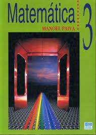

# Polinômios (Manoel Paiva, Vol 3, 2004)

Neste capítulo estarão contidos os resumos de **polinômios** de do livro de Matemática - Volume 3, do autor Manoel Paiva, 1º edição, 2004, da editora Moderna.

```{r echo=FALSE, fig.show="hold", out.width="50%", fig.align = "center", fig.cap="Livro - Matemática Vol 3 - Manoel Paiva, 2004 (Ed. Moderna, 1.ed.)"}

```

|Capítulo|Descrição|
|:--|:--|
| 19 |Polinômios em uma Variável|
| 20 |Generalidades sobre a divisão de um Polinômio por um Binômio do 1º Grau|
| 21 |Equações Polinomiais|
| 22 |Relações de Girard e o Teorema de Bolzano|


## Capítulo 19 - Polinômios em uma Variável

### Subseção Numerada 1

Lorem ipsum. Lorem ipsum. Lorem ipsum. Lorem ipsum. Lorem ipsum. Lorem ipsum. Lorem ipsum. Lorem ipsum. Lorem ipsum. Lorem ipsum. Lorem ipsum. Lorem ipsum. Lorem ipsum. Lorem ipsum. Lorem ipsum. Lorem ipsum. Lorem ipsum. Lorem ipsum. Lorem ipsum.

### Exercícios do Capítulo 19

Lorem ipsum. Lorem ipsum. Lorem ipsum. Lorem ipsum. Lorem ipsum. Lorem ipsum. Lorem ipsum. Lorem ipsum. Lorem ipsum. Lorem ipsum. Lorem ipsum. Lorem ipsum. Lorem ipsum. Lorem ipsum. Lorem ipsum. Lorem ipsum. Lorem ipsum. Lorem ipsum. Lorem ipsum.

### Seção não Numerada 3 {-}

Lorem ipsum. Lorem ipsum. Lorem ipsum. Lorem ipsum. Lorem ipsum. Lorem ipsum. Lorem ipsum. Lorem ipsum. Lorem ipsum. Lorem ipsum. Lorem ipsum. Lorem ipsum. Lorem ipsum. Lorem ipsum. Lorem ipsum. Lorem ipsum. Lorem ipsum. Lorem ipsum. Lorem ipsum.
eção 02

## Capítulo 20 - Generalidades sobre a divisão de um Polinômio por um Binômio do 1º Grau

### Subseção Numerada 1

Lorem ipsum. Lorem ipsum. Lorem ipsum. Lorem ipsum. Lorem ipsum. Lorem ipsum. Lorem ipsum. Lorem ipsum. Lorem ipsum. Lorem ipsum. Lorem ipsum. Lorem ipsum. Lorem ipsum. Lorem ipsum. Lorem ipsum. Lorem ipsum. Lorem ipsum. Lorem ipsum. Lorem ipsum.

### Exercícios do Capítulo 20

Lorem ipsum. Lorem ipsum. Lorem ipsum. Lorem ipsum. Lorem ipsum. Lorem ipsum. Lorem ipsum. Lorem ipsum. Lorem ipsum. Lorem ipsum. Lorem ipsum. Lorem ipsum. Lorem ipsum. Lorem ipsum. Lorem ipsum. Lorem ipsum. Lorem ipsum. Lorem ipsum. Lorem ipsum.

### Seção não Numerada 3 {-}

Lorem ipsum. Lorem ipsum. Lorem ipsum. Lorem ipsum. Lorem ipsum. Lorem ipsum. Lorem ipsum. Lorem ipsum. Lorem ipsum. Lorem ipsum. Lorem ipsum. Lorem ipsum. Lorem ipsum. Lorem ipsum. Lorem ipsum. Lorem ipsum. Lorem ipsum. Lorem ipsum. Lorem ipsum.

## Capítulo 21 - Equações Polinomiais

### Subseção Numerada 1

Lorem ipsum. Lorem ipsum. Lorem ipsum. Lorem ipsum. Lorem ipsum. Lorem ipsum. Lorem ipsum. Lorem ipsum. Lorem ipsum. Lorem ipsum. Lorem ipsum. Lorem ipsum. Lorem ipsum. Lorem ipsum. Lorem ipsum. Lorem ipsum. Lorem ipsum. Lorem ipsum. Lorem ipsum.

### Exercícios do Capítulo 21

Lorem ipsum. Lorem ipsum. Lorem ipsum. Lorem ipsum. Lorem ipsum. Lorem ipsum. Lorem ipsum. Lorem ipsum. Lorem ipsum. Lorem ipsum. Lorem ipsum. Lorem ipsum. Lorem ipsum. Lorem ipsum. Lorem ipsum. Lorem ipsum. Lorem ipsum. Lorem ipsum. Lorem ipsum.

### Seção não Numerada 3 {-}

Lorem ipsum. Lorem ipsum. Lorem ipsum. Lorem ipsum. Lorem ipsum. Lorem ipsum. Lorem ipsum. Lorem ipsum. Lorem ipsum. Lorem ipsum. Lorem ipsum. Lorem ipsum. Lorem ipsum. Lorem ipsum. Lorem ipsum. Lorem ipsum. Lorem ipsum. Lorem ipsum. Lorem ipsum.

## Capítulo 22 - Relações de Girard e o Teorema de Bolzano

### Subseção Numerada 1

Lorem ipsum. Lorem ipsum. Lorem ipsum. Lorem ipsum. Lorem ipsum. Lorem ipsum. Lorem ipsum. Lorem ipsum. Lorem ipsum. Lorem ipsum. Lorem ipsum. Lorem ipsum. Lorem ipsum. Lorem ipsum. Lorem ipsum. Lorem ipsum. Lorem ipsum. Lorem ipsum. Lorem ipsum.

### Exercícios do Capítulo 22

Lorem ipsum. Lorem ipsum. Lorem ipsum. Lorem ipsum. Lorem ipsum. Lorem ipsum. Lorem ipsum. Lorem ipsum. Lorem ipsum. Lorem ipsum. Lorem ipsum. Lorem ipsum. Lorem ipsum. Lorem ipsum. Lorem ipsum. Lorem ipsum. Lorem ipsum. Lorem ipsum. Lorem ipsum.

### Seção não Numerada 3 {-}

Lorem ipsum. Lorem ipsum. Lorem ipsum. Lorem ipsum. Lorem ipsum. Lorem ipsum. Lorem ipsum. Lorem ipsum. Lorem ipsum. Lorem ipsum. Lorem ipsum. Lorem ipsum. Lorem ipsum. Lorem ipsum. Lorem ipsum. Lorem ipsum. Lorem ipsum. Lorem ipsum. Lorem ipsum.